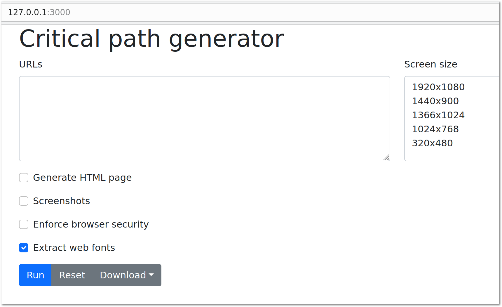

# CRITICAL PATH GENERATOR
Critical CSS path generator docker app



## Run the app

Running with docker

```bash
$ docker run -p "1080:3000" tbela99/critical
```
Using podman

```bash
$ podman run -p "1080:3000" tbela99/critical
```

Using docker-compose or podman-compose

### Yaml configuration

```yaml
version: "3.3"
services:
  web:
    image: tbela99/critical
    ports:
      - "1080:3000"

```

### Start the container

```shell

$ docker-compose up -d
```

head to [http://127.0.0.1:1080](http://127.0.0.1:1080) to access the app


### Stop the container

```shell

$ docker-compose stop
```
